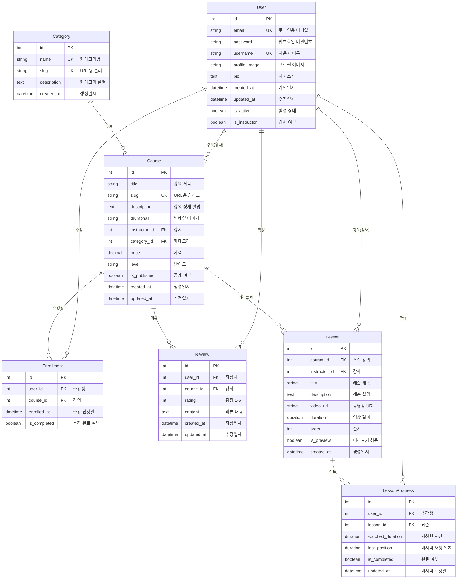

# ICT 교육 동영상 스트리밍 플랫폼 - Model 설계 산출물

## 1. ERD (Entity Relationship Diagram)

## 2. 제약조건 요약

| Model | 제약조건 | 설명 |
|-------|----------|------|
| Enrollment | `unique_together = ['user', 'course']` | 중복 수강 방지 |
| Review | `unique_together = ['user', 'course']` | 강의당 1개 리뷰 |
| Lesson | `unique_together = ['course', 'order']` | 강의 내 순서 중복 방지 |
| LessonProgress | `unique_together = ['user', 'lesson']` | 사용자별 레슨 진도 1개 |
